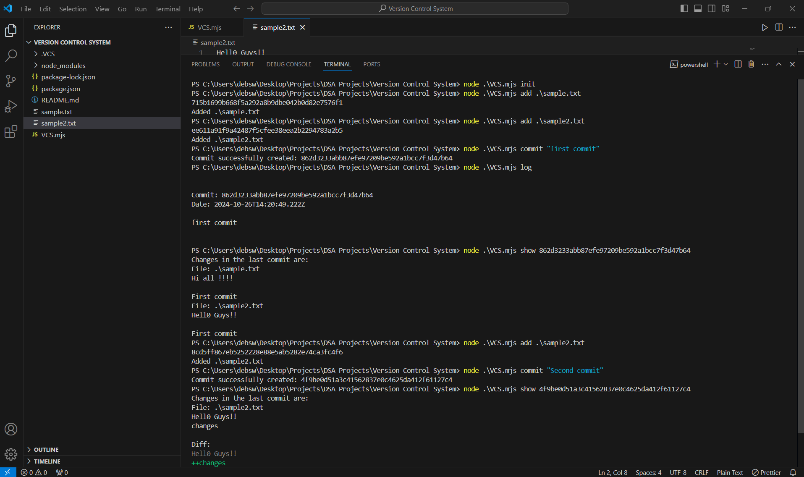

# Version Control System (VCS)

A lightweight version control system implemented in Node.js that mimics basic functionalities of popular systems like Git. It allows for file tracking, staging, committing, and viewing of file differences between commits.



## Features

- **Initialize Repository**: Creates a `.VCS` directory to store commits and object data.
- **Add Files**: Tracks and stages files for commit.
- **Commit Changes**: Saves the current state of staged files along with a message.
- **View Commit Logs**: Displays a list of all previous commits, with timestamps and commit messages.
- **Show Commit Differences**: Shows line-by-line differences between the current commit and the previous commit.

## Prerequisites

- **Node.js** (v14+ recommended)
- **NPM** (installed with Node.js)

## Installation

Clone the repository to your local system:

```bash
git clone https://github.com/SwarnadeepDeb/Version-Control-System-VCS-
cd Version-Control-System-VCS-
```

Install any required dependencies using `npm`:

```bash
npm install
```

## Usage

### Initialize the Repository

To start using VCS in your project directory, initialize a new repository by running:

```bash
node VCS.mjs init
```

This creates a `.VCS` folder in your current directory, containing the necessary structure for tracking files.

### Commands

- **Add Files**

  To stage files, use the `add` command:

  ```bash
  node VCS.mjs add <filename>
  ```

  Example:
  ```bash
  node VCS.mjs add sample.txt
  ```

- **Commit Changes**

  Once files are staged, you can save their state with a commit message:

  ```bash
  node VCS.mjs commit "Your commit message"
  ```

- **View Commit Log**

  To see a log of all commits, use the `log` command:

  ```bash
  node VCS.mjs log
  ```

- **Show Differences for a Commit**

  To view the changes in a specific commit, use the `show` command:

  ```bash
  node VCS.mjs show <commitHash>
  ```

  Replace `<commitHash>` with the hash of the commit you want to inspect.

## Example Workflow

1. Initialize a new VCS repository:

   ```bash
   node VCS.mjs init
   ```

2. Stage files to be tracked:

   ```bash
   node VCS.mjs add sample.txt
   ```

3. Commit changes:

   ```bash
   node VCS.mjs commit "Initial commit"
   ```

4. View the commit log:

   ```bash
   node VCS.mjs log
   ```

5. Show differences for a specific commit:

   ```bash
   node VCS.mjs show <commitHash>
   ```

   Replace `<commitHash>` with an actual commit hash from the log.

## How It Works

- **Staging and Committing**: Files added to the staging area are saved with a hash (SHA-1) to ensure data integrity. On committing, a commit object is created containing the commit message, timestamp, file hashes, and a reference to the previous commit.
- **File Differences**: Differences are generated by comparing files in the current commit against those in the previous commit using the `diff` library.

## License

This project is licensed under the MIT License.
